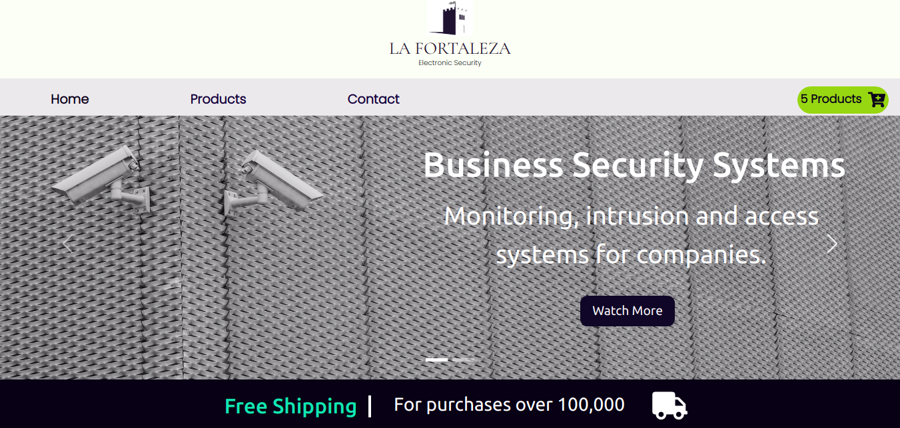
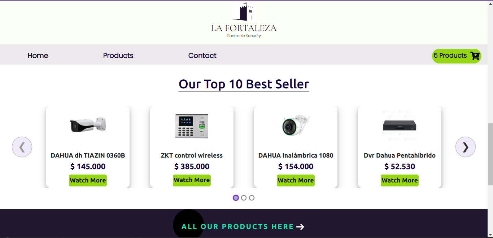
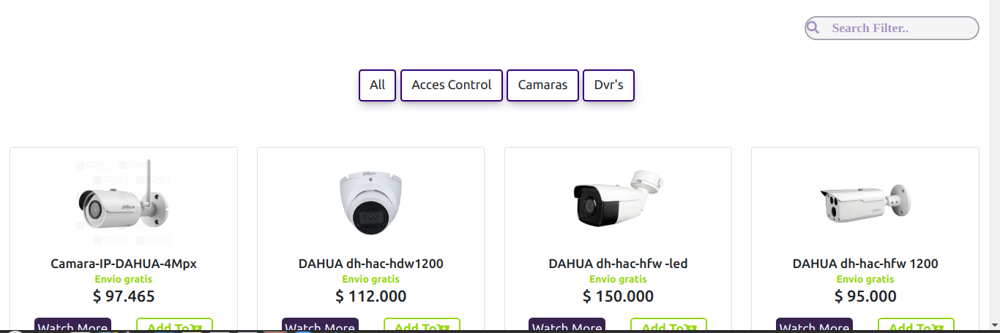
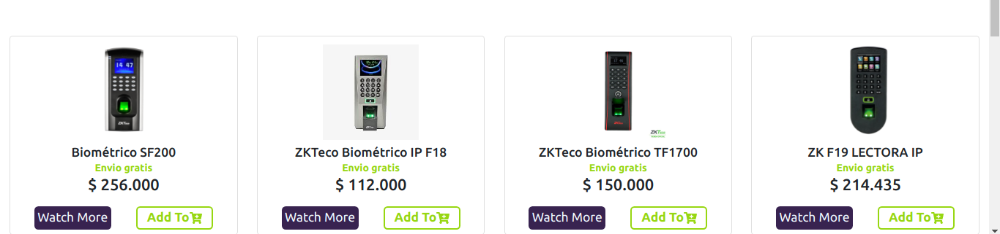
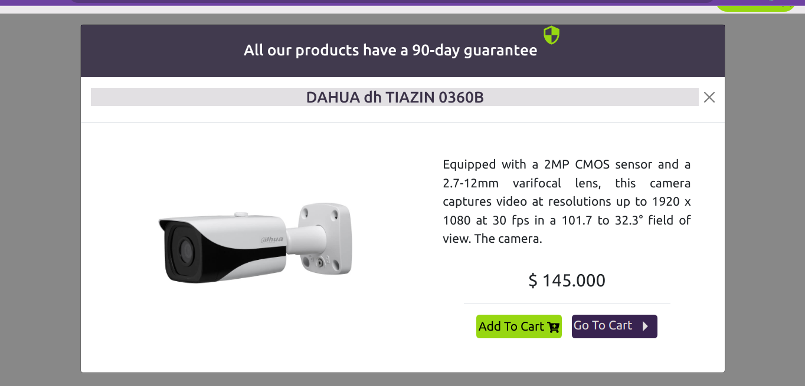
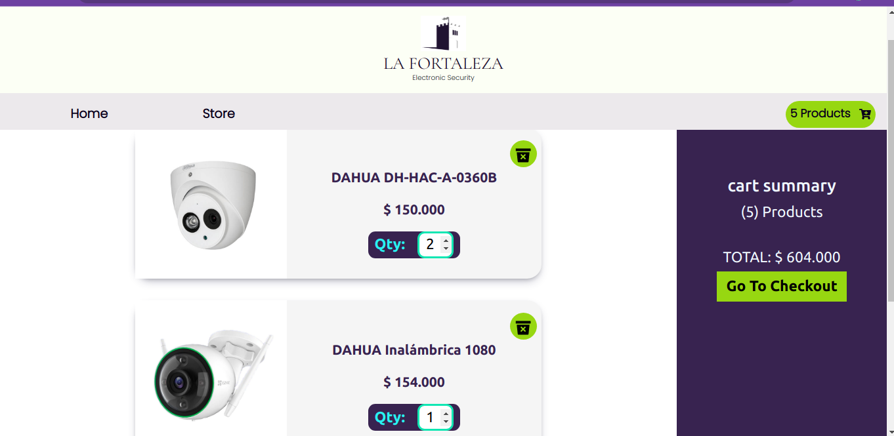
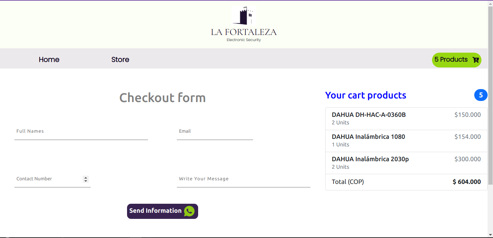

<h3 style="text-align:justify;"><strong>E-commerce website made on React js and optimized with Redux, has a rich product catalog with support for an unlimited number of products and filter categories, It has a shopping cart that allows the user to select the number of units for each product, It also allows to send all the data and the order of the client trough whatsapp. </strong></h3> 

This project was generated with 
* [Create React App](https://github.com/facebook/create-react-app).

* [Redux](https://www.npmjs.com/package/redux) 
 
* [React-elastic-carousel](https://www.npmjs.com/package/react-elastic-carousel)
  
* [Styled Components](https://styled-components.com/)

* [React Paginate](https://www.npmjs.com/package/react-paginate)
  
  <h2 style="text-align:center;color: purple">Installation</h2>
  *You can clone our public repository on: 

    [La-fortaleza-E-commerce Repositorie](https://github.com/carolo180/La-fortaleza-E-commerce.git)
   
  * ### npm i or npm install: To install all dependices and libraries.

     

  *  ### npm start: Runs the app in the development mode to view it in your browser.
    
    

  <h2 style="text-align:center;color: purple">Landing Page</h2>         
     
     
               
 

On this page there is a dynamic navigation bar that allows easy navigation through the website, you will also find a carrusel with top 10 bestseller and a contact info with the map ubication. 

<h2 style="text-align:center;color: purple">Store</h2>         
    
                
 
This page show all galery of products and has a filter for category and a input filter for key word.

 
  
Detail Producy Sight.

  
  
Purchase summary.
          
  
  
Checkout shopping form.
  